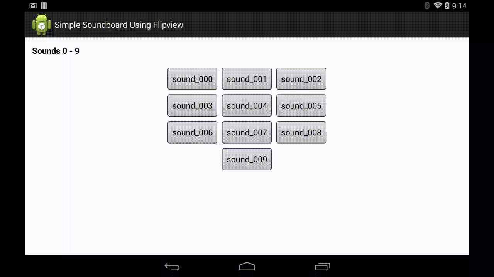

android-viewpager-play
======================

Implementing an example soundboard app that uses the Android ViewPager Layout Manager

Demos
-----
 
Current state of things, will update .gif as I add more features.

Motivation
----------
The idea to create a swiping multipage framework for publishing a soundboard app which could
easily be customized by replacing the files that exist in the res/raw directory and recompiling the app, without any/little
work in updating or customing the Java/xml files of the app.

The way the app is currently designed, it gets a file listing of the res/raw directory and add buttons to the layout of each page, 
naming the buttons based on the file names, and using parameters to controls how many buttons per row and buttons per page.

Future work
-----------
* Integrate MySqlLite db in order to render more interesting layouts datewise, like proper sound titles and potentially images associated with each sound.
* Create a script for programmatically generating the data for the database given a bunch of mp3s (Potentially extract the title of the .mp3 from the ID3 tag?)
* Look into replacing currently use of MediaPlayer with SoundPool to play multiple sounds simutaneously.  (Maybe/maybe not, apparently there are memory limitations with SoundPools that might not be good for soundboard apps).
* Added options for using sound as ringtone or notification.

Links
-----
http://developer.android.com/reference/android/support/v4/view/ViewPager.html
https://github.com/astuetz/PagerSlidingTabStrip
